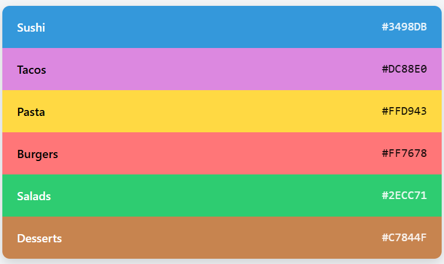

CSV Rendered Into a Swatch Palette
==================================

## How to Use

1. Open the SPA in your browser.
2. Paste your CSV into the textarea.
3. Click **Render Palette**.
4. View the resulting swatches below the button.

Each swatch shows the **category name** and **hex code**, with text color automatically adjusted for readability.

---

## Screenshot

*This shows a rendered palette from the example CSV.*

---

## Technical Details

- **HTML/CSS/JavaScript** only — no frameworks required.
- Parses CSV line-by-line, skipping the header.
- Determines text color based on luminance:
  - Light colors → black text
  - Dark colors → white text
- Fully client-side, no server needed.

---

## Customization

- **Styling**: Adjust colors, fonts, or spacing via CSS.
- **CSV format**: Only the first two columns are used (`Category` and `Hex`). Extra columns are ignored.
- **Contrast calculation**: Modify the `getContrastColor()` function if you want a different contrast threshold.

---

## License

MIT License – free to use and modify.

